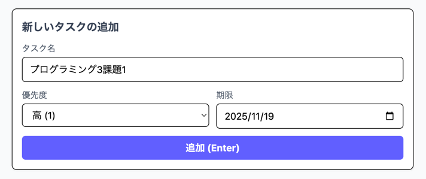
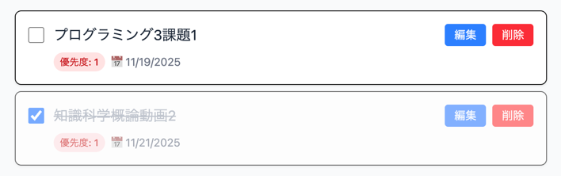
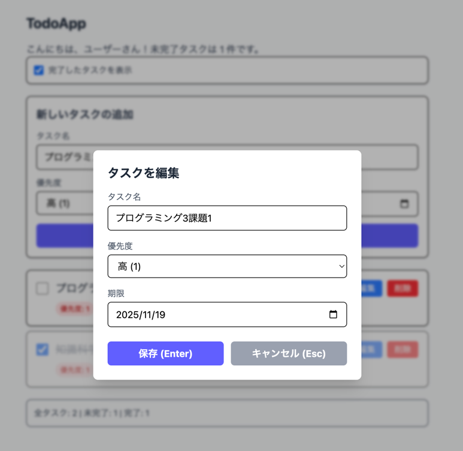
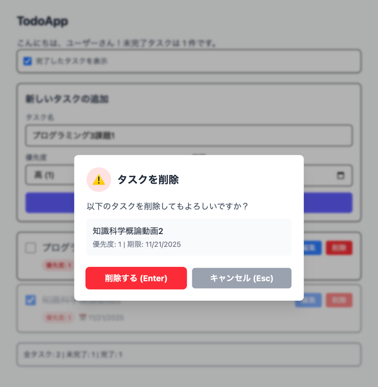
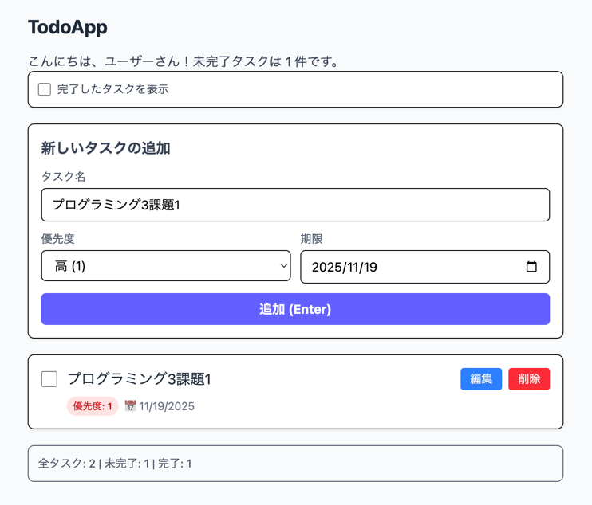

# TodoApp

GitHub Pages URL 
https://kz91.github.io/todo

React + TypeScript で作成したシンプルで使いやすい Todo リスト Web アプリです。  
タスク管理、優先度・期限管理、完了タスクの表示切替など、日々の作業を効率化できます。

---

## アプリの特徴

- **タスク管理**
    - タスクの追加、編集、削除
    - 完了済みタスクはチェックボックスで管理
    - タスクの優先度（高・中・低）を設定可能
    - タスクの期限を設定可能

- **便利な機能**
    - 未完了タスクのみの表示切替
    - 期限切れタスクを赤文字で強調表示
    - 優先度ごとに色分けされたバッジ表示
    - 編集・削除時に確認ダイアログを表示
    - キーボード操作に対応（Enterで保存・追加、Escでキャンセル）
    - IME入力時の Enter 判定に対応

- **永続化**
    - LocalStorage に保存されるため、ブラウザを閉じてもデータ保持

- **UI/UX の工夫**
    - タスクの優先度を色分けし視覚的に判別しやすく
    - 期限切れタスクは赤文字で強調
    - モーダルダイアログで操作ミスを防止
    - レスポンシブデザインに対応（スマホ・PC 両対応）

---

## 取り組みで工夫した点・オリジナリティ

- 優先度・期限を組み合わせたタスク管理で、視覚的に重要度を判断可能
- Enterで登録、Escでキャンセルできるようにし、UXを改善
- LocalStorageで簡易永続化し、サーバーなしでも動作可能
- UI の色分け・モーダルで直感的操作が可能に
- タスク追加時のデフォルト期限を自動設定（1週間後）

---

## 使用方法

1. **タスクの追加**
    - タスク名を入力
    - 優先度を選択
    - 期限を入力（省略可。自動で1週間後が設定されます）
    - 「追加」ボタンまたは Enter キーで追加
   

2. **タスクの完了/未完了切替**
    - チェックボックスをクリック
   

3. **タスクの編集**
    - 編集ボタンをクリック
    - 名前・優先度・期限を変更
    - 保存ボタンまたは Enter キー
   

4. **タスクの削除**
    - 削除ボタンをクリック
    - 確認ダイアログで削除を確定
   

5. **完了済みタスクの表示切替**
    - 「完了したタスクを表示」チェックボックスで表示 ON/OFF
      

---

## 技術スタック

- React
- TypeScript
- Tailwind CSS
- LocalStorage

---

## ファイル構成（主要ファイル）

- `src/App.tsx` : メインコンポーネント
- `src/TodoList.tsx` : タスク一覧表示と編集・削除管理
- `src/EditTodoDialog.tsx` : タスク編集用ダイアログ
- `src/DeleteTodoDialog.tsx` : タスク削除確認ダイアログ
- `src/todoStorage.ts` : LocalStorage 保存・読み込み
- `src/types.ts` : Todo 型定義

開発期間: 2025.10.30 ~ 2025.11.19（約40時間）